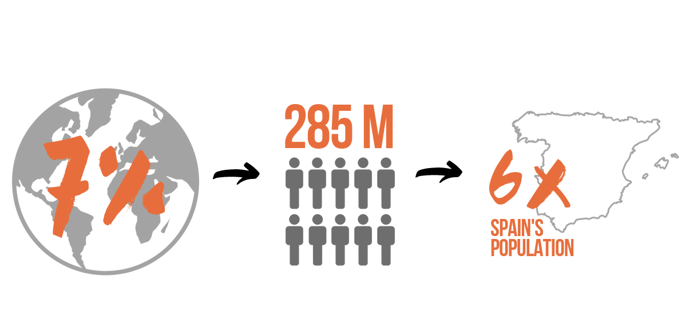
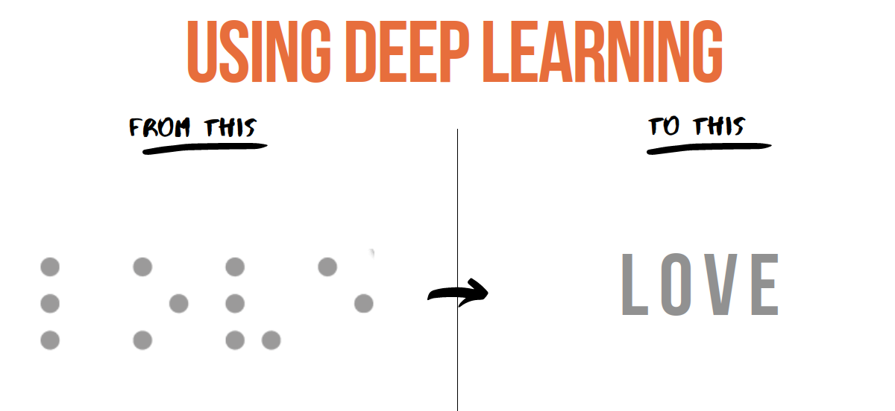

# Braille translator

## Origin of the idea
Did you know that 7% of the world's population is blind? A total of 285 million people, which is six times the entire population of Spain.

Despite this, the rest of the population, who do not suffer from this visual impairment are not taught their alphabet, which means we cant communicate with them in a non-audiovisual way.

That is why I found it very interesting to create a machine learning model that could translate braille into normal text. This way, any person who does not suffer from this disability could understand the language by simply taking a photo and introducing it to the model to be translated.

-----------------

## How is the project structured?

I've divided it into three parts; model training, characters prediction and word prediction.

1. **Training the model**

I've used **convolutional neural networks**, a Deep Learning algorithm designed to work with images, taking these as input, and assigning weights to certain elements in the image to differentiate them.

The network takes as input an image and transforms it. It converts it into grayscale, scales the image  28x28 and normalizes the array values by diving them by 255. 
After doing so and adding the number of convolutional layers that gave better results, the model has turned out with a  71% testing accuracy.

(located in the Code folder, filename: keras_model)

2. **Predicting Characters**

To do so, I **import from a new folder images my model has never seen** and try to predict the class (the letter). To do so, the image has to be the following way;
- size : 28x28
- grayscale: 1 channel
- normalized array: numbers between 0 and 1.

Apart from this, I've used the library pillow to manipulate and load images

(located in the Code folder, filename: keras_predicts_letters)

3. **Predicting words**

In order to fo my model to be able to predict the letters in a word, first, we have to divide the word into sections. These sections must fit into the criteria of the data used to train the model, otherwise, the prediction will not be accurate.
To do so, I've followed 4 steps:
- Divide the image into black or white (1 or 0)
- Draw a vertical line where the image is white (this means there is a character there)
- Calculate the distance between the start of each line
- Create a function to understand if from line to line is a new character or the same one
- Divide the word into characters
- Pass the list of characters into the model in order to be predicted

(located in the Code folder, filename: keras_predicts_words)

-----
## There is room for improvement:

- The model works very well if the image has been cropped correctly, otherwise, it no longer fits in the written function and therefore the image passed to the model cant be predicted.
- I would have liked, to create an API where the user can insert these images to be translated instantly.

## Conclusion

I have really enjoyed working on a project since day one. Deep learning is growing more and more, and everyday computers can preform cooler and more intelligent operations, and I think is very cool to be able to participate in this in some way. I have so much room for learning regarding this topic.

I have learned how convolutional neural networks work and how to manipulate them depending on the output to get the highest accuracy possible.

I've also used some new tools, like keras for image generation and pillow for image manipulation.

Overall it has been a great experience that would have even resulted in a  better output if I have had a little bit more time.

